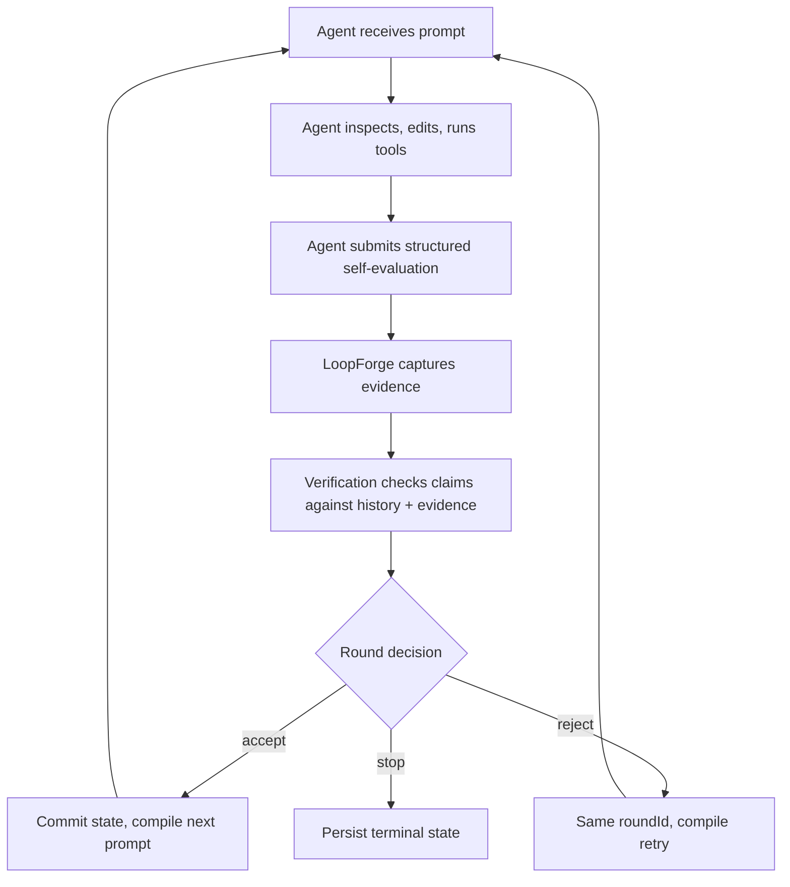

# LoopForge

[中文文档](./README.zh-CN.md) | [Package docs](./loopforge/README.md) | [Protocol schema](./loopforge-protocol.json)

**A recoverable cognitive state runtime for AI coding agents.**

AI coding agents handle single-turn tasks well. Multi-turn tasks degrade: objectives compress into noise, constraints vanish, failed approaches loop, and agents declare success without evidence. A context window reset can erase the only coherent record of the plan.

LoopForge exists because **state management across rounds is a runtime problem, not a prompt problem**. You cannot prompt your way out of context collapse.

> **v2.0.1** — `npm install loopforge`. MCP server (9 tools) + Library API + Verification Gate (10 checks) + Enforcement Gate (5 rules) + EvidenceProvider (Git + Command) + Pause/Resume + L0/L1/L2 prompt density. Zero runtime dependencies. 271 tests. Node.js ≥18.

---

## Design philosophy

**The Agent owns execution. LoopForge owns the round boundary.**

This is the foundational split. The external Agent reads code, edits files, runs tools, and chooses how to reason. LoopForge maintains a typed, verifiable cognitive state outside the model context — and enforces that state at every round boundary.

Four principles follow from this split:

### 1. One canonical state, one derived view

The objective, constraints, success criteria, evidence, decisions, progress, corrections, and recovery data live in one typed state model. The Markdown state file is a human-readable projection — it can be regenerated, deleted, or disabled. It never becomes a second recovery truth.

### 2. Verification gate — cross-round consistency checks

After each round, the verification gate compares the Agent's self-evaluation against committed history and captured evidence. Ten checks run before any feedback is committed:

- **Progress regression**: estimate dropped >0.2 without explanation → warn
- **Empty success**: claims success, tests pass, but no files changed → warn
- **Premature completion**: `success: true` but criteria still unmet → **error**
- **Duplicate discovery**: reports a constraint as "new" that was already known → warn
- **Recurring violation**: same constraint violated 3 consecutive rounds → **error**
- **Retract-then-rediscover**: retracts a constraint immediately after discovering it → warn
- **File honesty**: reported `files_changed` doesn't match Git evidence → warn
- **Command evidence mismatch**: agent's `test_results` don't match actual test-runner output → warn (hidden failures → **error**)
- **Required command failure**: claims success but a `required` verification command failed → **error**

Verdicts aggregate to `trusted`, `suspect`, or `contradicted`. Warnings flow into the next prompt as advisory notes. Contradictions (any error-level flag) halt the round before feedback is committed.

### 3. Enforcement gate — hard round-boundary decisions

Verification describes inconsistencies. Enforcement decides what happens next. The current rules:

- **R1 Fake success**: `success: true` with unmet criteria → **reject**
- **R2 Recurring violation**: same constraint violated across attempts → **reject**
- **R3 Empty success**: success claim with no changed files, no test evidence → **reject**
- **R4 Progress stall**: no progress change across consecutive rounds → **reject**
- **R5 Max rejections**: repeated rejection without resolution → **terminate**

A rejection keeps the same logical `roundId`, increments the attempt counter, and commits **nothing** — no success trajectory update, no constraint history mutation, no rolling summary update. The Agent receives a rejection prompt explaining exactly what to fix and redoes the same round. This zero-commit rule is the core defense against evaluation contamination: a bad round cannot poison future prompts.

### 4. Evidence from the workspace, not from the prompt

LoopForge captures evidence at round boundaries so it can answer "did the Agent actually do what it claims?"

**Git evidence** (enabled by default): tracked, staged, and untracked file state is snapshotted before and after each round. Even files that were already dirty before the round are tracked — restoring or further modifying them is visible in the diff.

**Command evidence** (opt-in, configured in `loop_policy.json`): test runners, linters, type-checkers, or build tools run with `shell: false`, workspace-bounded CWD, per-command deadlines, and output caps (20k chars hard limit). A command marked `required` directly contradicts an Agent success claim if it fails, times out, or goes missing. Command providers also parse test-runner output (Jest, Mocha, pytest, Go test, PHPUnit) and cross-validate the parsed counts against the Agent's reported `test_results` — catching "all tests pass" claims when the runner actually shows failures.

---

## How one loop works



Each round has a stable `roundId`. Persisted decisions make restart recovery idempotent — resuming a loop never advances the same round twice.

Prompt levels (L0/L1/L2) control **state density only**: how much of the canonical state the Agent receives. L0 is the rejection retry, L1 is normal continuation, L2 is first-round or full rehydration. These levels do not select reasoning techniques — that belongs to the Agent.

**Recovery is built in, not bolted on.** Every round transaction is persisted before the next prompt is delivered. If the Agent's context compacts, the MCP process restarts, or the user intentionally pauses, `resume` reconstructs the session from typed JSON and returns the correct prompt at the correct round — without advancing the round twice. `replay` exposes the full committed timeline for audit; `health` checks goal alignment, constraint integrity, and drift across rounds.

---

## Quick start

```bash
git clone https://github.com/kyrielrving11/LoopForge.git
cd LoopForge/loopforge
npm install
npm run build
npm link
loopforge doctor
```

Or install from npm:

```bash
npm install -g loopforge
loopforge init --client claude
claude mcp add loopforge -- npx loopforge mcp
```

---

## MCP integration (Agent-driven)

The Agent calls LoopForge tools through MCP. LoopForge provides each prompt, verifies each evaluation, and persists state. The Agent remains the execution owner — LoopForge does not implement MCP Tasks or a background agent.

```bash
loopforge init --client claude
claude mcp add loopforge -- npx loopforge mcp
```

### Nine MCP tools

| Tool | Purpose |
|------|---------|
| `loopforge_start` | Start a loop — compiles Round 1 prompt from task + constraints |
| `loopforge_next` | Submit self-evaluation → get next prompt (or `null` + stop reason) |
| `loopforge_status` | Current round, success trajectory, active technique |
| `loopforge_pause` | Pause a running loop — state persisted to vault, resumable later |
| `loopforge_resume` | Resume loop from vault after pause or process restart |
| `loopforge_stop` | Manual stop with final trajectory preserved |
| `loopforge_list` | All active sessions (in-memory + vault-persisted) |
| `loopforge_replay` | Full timeline: rounds, decisions, success flags |
| `loopforge_health` | Goal alignment, constraint integrity, drift, strategy stability |

Each tool result includes typed `structuredContent`. Input is validated at the server boundary. Rejection prompts return the same round — the Agent redoes the work without advancing.

### Self-evaluation (what the Agent reports each round)

The evaluation is passed as a structured MCP tool parameter — validated by the MCP client before reaching the server.

```json
{
  "success": true,
  "output_summary": "Fixed 3 reentrancy bugs. 24/24 tests pass.",
  "constraint_violations": [],
  "should_continue": true,
  "discovered_constraints": ["All external calls must use SafeERC20"],
  "objective_refinement": "Scope expanded: access control is part of a larger upgradeable proxy pattern",
  "emerged_subtasks": ["Audit upgrade proxy initialization", "Verify timelock parameters"],
  "execution_evidence": {
    "files_changed": ["contracts/Token.sol", "test/Token.test.ts"],
    "test_results": {"passed": 24, "failed": 0, "skipped": 0},
    "success_criteria_met": ["No reentrancy vectors remain"],
    "success_criteria_remaining": ["Access control verified", "Overflow checks complete"],
    "progress_estimate": 0.4
  },
  "retracted_constraints": [],
  "revised_success_criteria": [],
  "wrong_assumptions": [],
  "worker_results": []
}
```

Every field has a specific downstream consumer — nothing decorative.

---

## Durable storage

Typed JSON under `.loopforge/loops/<sha256(loopId)>/`. Session and round documents are the durable transaction truth. Atomic writes use temporary-file-plus-rename. Store locks protect writes; renewable session leases fence concurrent MCP processes.

```text
.loopforge/
  loops/<sha256(loopId)>/
    metadata.json   session.json   rounds/1.json   rounds/2.json
  state/<loopId>-state.md   (optional derived view)
```

---

## Recompile levels

| Level | When | What |
|-------|------|------|
| **L0 Retry** | Enforcement rejection | Same roundId, same task — prompt contains the rejection reason and fix instructions |
| **L1 Continue** | Default — all normal rounds | Thin prompt: task + delta + verification flags. State lives in the derived state file |
| **L2 Restart** | Round 1, recovery, checkpoint boundary | Full prompt: task + objective + all constraints + rolling summary + progress dashboard |

---

## Key features

### Cognitive evolution
- **Constraint discovery (P0)** — Agent discovers new guardrails during execution. Auto-merged into active constraints.
- **Objective refinement (P1)** — Understanding deepens over rounds. Objective grows a version chain — appended, never replaced.
- **Emergent subtasks (P2)** — Sub-problems surface organically. Feed the next-task suggestion without pre-planning.
- **Execution evidence (P4)** — Structured reporting of files changed, test results, criteria met/remaining, progress estimate.
- **Progress tracking (P4)** — Objective vs subjective progress with gradient detection. Early stall warning before the circuit breaker fires.
- **Self-correction (P5)** — Retract wrong constraints, revise bad success criteria, flag incorrect assumptions.

### Verification gate (10 checks)
Cross-round self-eval validation against lineage + evidence. Three verdict tiers: `trusted` → normal flow; `suspect` → warnings injected into next prompt; `contradicted` → success flag excluded from trend, 🚫 flags become hard constraints.

### Enforcement gate (5 rules)
Hard round-boundary decisions. Rejects invalid self-evaluations (agent must redo same round), terminates unrecoverable loops. Runs before state changes so rejected rounds don't pollute the vault.

### Evidence provider
Pluggable evidence capture at round boundaries. Built-in providers: Git (tracked/staged/untracked file detection with fingerprinting) and Command (shell-free test-runner/linter execution with cross-validation against agent-reported results). Configurable via `loop_policy.json`.

### Pause/resume
Graceful suspension at round boundaries. State persisted to vault — sessions survive process restarts. Resume from both paused and crashed states.

### Session leases
Renewable, epoch-tracked leases prevent concurrent MCP processes from advancing the same loop. Dead-owner detection via `signal 0` + stale lock timeout.

### Other
- **L0/L1/L2 prompt density** — control state density only, not reasoning strategy
- **Circuit breaker** — consecutive failure detection with configurable threshold
- **Replay engine** — time-travel queries: timeline, diff, round-level audit
- **Policy externalization** — all tunables in `loop_policy.json`
- **Structured observability** — event logging (`LOOPFORGE_LOG=1`) + policy metrics
- **Zero runtime dependencies** — Node.js stdlib only, TypeScript strict mode

---

## Operational boundaries

- LoopForge does **not** sandbox the Agent. Tool permissions belong to the Agent host.
- Command evidence runs with `shell: false`. The executable itself must be trusted.
- Path escapes (lexical + realpath, including symlinks/junctions) are checked on every command and state-file write.
- Store locking and session leases prevent accidental concurrent advancement — they are not a distributed consensus system.
- Prompt text is redacted from CLI inspection by default.
- Zero runtime dependencies. Review the package and policy before use.

---

## Project structure

```
LoopForge/
├── loopforge/                 # TypeScript package
│   ├── src/
│   │   ├── backends/          # VaultBackend interface
│   │   ├── mcp/               # MCP server, session manager, tools
│   │   ├── tests/             # 271 tests (Node.js built-in runner)
│   │   ├── canonical-state.ts # Typed cognitive state + deterministic hashing
│   │   ├── cli.ts             # Unified loopforge command
│   │   ├── engine.ts          # Session state holder + compile dispatcher + feedback persistence
│   │   ├── enforcement-gate.ts# 5 enforcement rules
│   │   ├── evidence-provider.ts# Git + Command evidence capture
│   │   ├── interop.ts         # Ecosystem checkpoint bridge (experimental)
│   │   ├── loop-compiler.ts   # State evolution + prompt compilation
│   │   ├── loop-store.ts      # Typed per-loop JSON persistence
│   │   ├── observability.ts   # Structured tracing
│   │   ├── policy-metrics.ts  # Verification + round outcome metrics
│   │   ├── policy.ts          # Policy loading + state file I/O
│   │   ├── prompt-assembler.ts# Single-pass prompt renderer
│   │   ├── prompt-policy.ts   # L0/L1/L2 view selection
│   │   ├── protocol.ts        # All types + factory functions
│   │   ├── replay.ts          # Round timeline + diff queries
│   │   ├── round-coordinator.ts# Verify → enforce → stop pipeline
│   │   ├── round-driver.ts    # Compile + evidence + transaction glue
│   │   ├── round-transaction.ts# Schema-versioned round commit/replay
│   │   ├── self-eval.ts       # Self-evaluation extraction + parsing
│   │   ├── storage.ts         # Session + round persistence adapters
│   │   └── verification-gate.ts# 10 cross-round consistency checks
│   ├── dist/                  # Compiled JS + type declarations
│   └── loop_policy.json       # Default policy
├── loopforge-protocol.json    # JSON Schema (draft 2020-12)
└── README.md / README.zh-CN.md
```

---

## API modules

| Import | Purpose |
|--------|---------|
| `loopforge` | `createEngine()`, `LoopForgeEngine`, `McpServer`, `SessionManager`, all types |
| `loopforge/compiler` | `compileLoop()`, `decideLevel()`, `buildSelfEvalBlock()` |
| `loopforge/replay` | `ReplayBackend` — `replay()`, `timeline()`, `diff()` |
| `loopforge/mcp` | `McpServer`, `SessionManager` — JSON-RPC transport + session lifecycle |

---

## License

MIT
