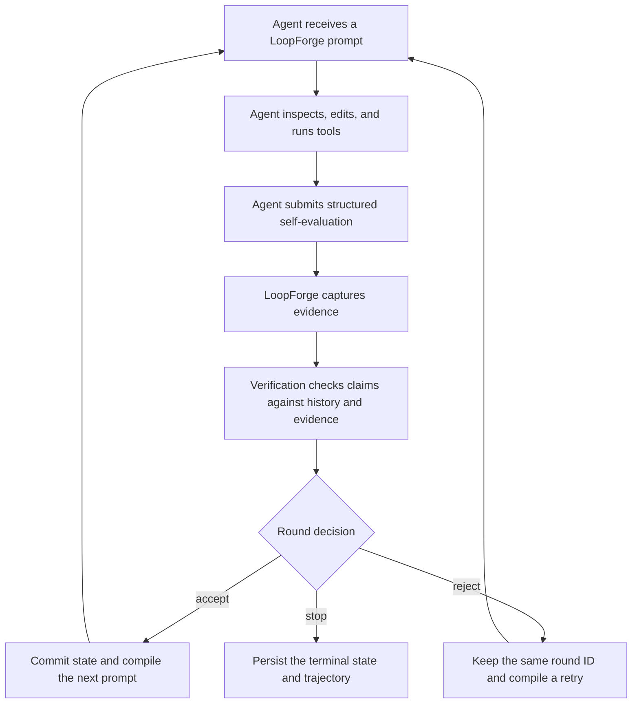

# LoopForge

**A recoverable cognitive state runtime for AI coding agents.**

[中文文档](./README.zh-CN.md) | [Package documentation](./LoopForge/README.md) | [Protocol schema](./loopforge-protocol.json)

AI coding agents are good at completing a focused request. Long tasks are harder. After several rounds, the original objective gets compressed, newly discovered constraints disappear, a failed approach gets retried, or the Agent declares success before the repository evidence supports it. A process restart can erase the only useful copy of the plan.

LoopForge gives the Agent a durable round boundary. It records the objective, success criteria, constraints, evidence, decisions, progress, corrections, and recovery state outside the model context. The Agent still reads the repository, edits files, runs commands, and chooses how to reason. LoopForge keeps the work coherent and recoverable while that Agent remains in control.

The current workspace contains the `2.0.0-rc.1` release candidate. The npm package lives in [`LoopForge/`](./LoopForge/), requires Node.js 18 or newer, uses TypeScript, and has zero runtime dependencies.

## What LoopForge helps with

LoopForge is useful when a coding task lasts long enough for state management to become part of the problem:

- A repository audit spans architecture, correctness, security, tests, documentation, and release checks.
- A refactor must preserve public APIs and other constraints across many edits.
- A migration uncovers new requirements while implementation is already in progress.
- A difficult defect needs several hypotheses, experiments, and rejected attempts.
- The Agent may be interrupted, compact its context, restart, or continue in a later session.
- Success claims need to be checked against Git changes and real verification commands.
- A team needs an auditable record of what each round changed, learned, rejected, and committed.

For short requests that fit in one Agent turn, LoopForge may be unnecessary. Its value appears when the task has enough history that losing or distorting that history would change the outcome.

## What it does and where the boundary is

| LoopForge does | The external Agent does |
| --- | --- |
| Stores the canonical objective and evolving cognitive state | Reads source code and documentation |
| Compiles the next prompt from committed state | Chooses a reasoning approach |
| Captures Git and configured command evidence | Edits files and runs tools |
| Verifies self-evaluation across rounds | Reports an honest structured evaluation |
| Accepts, rejects, or terminates a round | Redoes rejected work when required |
| Persists round transactions and recovery data | Decides when to ask the user for help |
| Provides pause, resume, replay, health, and inspection | Remains the owner of the user task |

LoopForge is not a model, coding Agent, job scheduler, or unattended worker. It deliberately does not create a second Agent in the background. The Agent already connected to the user's repository remains the execution owner.

## How one loop works



Each logical round has a stable `roundId`. If enforcement rejects an attempt, LoopForge increments the attempt number but does not advance the round or commit its feedback. An accepted attempt updates the canonical state exactly once. Persisted decisions make restart recovery idempotent, so resuming a loop does not advance the same round twice.

## Core capabilities

### Canonical cognitive state

LoopForge keeps one typed state model that both prompt rendering and the human-readable state file consume. The state includes:

- The original objective, objective version, and refinement history.
- Success criteria and the criteria still remaining.
- Hard constraints, active constraints, and retired constraints.
- Changes since the previous accepted round.
- New discoveries, emerged subtasks, blockers, and wrong assumptions.
- Progress estimates, changed files, and reported test results.
- Cross-round outcomes, recurring issues, and failed patterns.
- Verification findings, checkpoints, the next action, and optional external context.

Markdown is a derived view. It cannot silently become a second recovery truth.

### One prompt artifact per attempt

Every attempt produces one immutable `PromptArtifact`. It records the exact rendered prompt together with its prompt hash, canonical state hash, round ID, attempt number, state level, included sections, character budget, and generation time. This makes it possible to answer which state produced a prompt and whether two attempts received the same instructions.

L0, L1, and L2 control how much state the Agent receives:

| Level | When it is used | What the Agent receives |
| --- | --- | --- |
| L0 | A rejected attempt must redo the same logical round | Rejection requirements and information that changed since the previous attempt |
| L1 | Normal continuation | A compact state capsule with the current task, constraints, progress, and next action |
| L2 | First round, checkpoint, goal change, or full refresh | The full canonical state needed to rehydrate the task |

These levels do not choose chain-of-thought, tree search, or any other prompt technique. Reasoning belongs to the Agent.

### Cross-round verification

The verification gate compares the current self-evaluation with committed history and captured evidence. It can flag:

- A large unexplained progress regression.
- A success claim with passing tests but no changed files.
- A success claim while criteria remain unfinished.
- A constraint reported as newly discovered even though it was already known.
- The same constraint violation recurring for three rounds.
- A constraint retracted immediately after discovery.
- Reported file changes that do not match Git evidence.
- Reported evidence that does not match provider snapshots.
- A required verification command that failed, timed out, is missing, or has an invalid working directory.

Findings are aggregated into `trusted`, `suspect`, or `contradicted` verdicts. Warnings can continue into the next prompt. Contradictions reach the enforcement gate before feedback is committed.

### Round-boundary enforcement

Verification describes inconsistencies. Enforcement decides what happens next. The current rules reject fake completion, recurring violations, unverifiable success, and stalled progress. Repeated rejection or a stall that the Agent cannot resolve can terminate the loop with `enforcement_terminated`.

Rejected attempts do not update the success trajectory, constraint history, rolling summary, or durable round result. This zero-commit rule prevents an invalid evaluation from contaminating later prompts.

### Evidence from the workspace

Git evidence is enabled by default. LoopForge captures tracked, staged, and untracked file state at round boundaries and compares before and after snapshots, including files that were already dirty before the round.

Command evidence is optional and explicit. A project can configure tests, builds, linters, type checks, or another executable as authoritative evidence. Commands:

- Run with `shell: false` and an executable plus argument array.
- Use a working directory that must remain inside the workspace after real-path resolution.
- Have a deadline and terminate the child process on timeout.
- Retain bounded output, with a hard maximum of 20,000 characters.
- Produce structured statuses such as `passed`, `failed`, `timeout`, `missing`, `invalid_cwd`, and `aborted`.
- Can be marked `required`, causing a failed result to contradict an Agent success claim.

### Durable recovery and process ownership

The default `FileLoopStore` writes typed JSON with temporary-file plus rename semantics. Loop IDs are mapped to SHA-256 directory names, avoiding prefix collisions and unsafe path construction. A store lock protects writes, and renewable session leases prevent two MCP processes from advancing the same loop concurrently.

Running and paused sessions can be reconstructed after an MCP process restart. Pause preserves the current transaction. Resume returns the correct prompt without resetting progress. Stop and cleanup paths are idempotent.

### Replay, inspection, health, and tracing

LoopForge exposes the committed timeline for debugging and audit work. You can inspect a session, read one round, compare progress, and replay decisions without relying on the Agent's current context. Full prompts are redacted by default from CLI inspection and only shown with an explicit flag.

The runtime also supports structured tracing, policy effectiveness metrics, terminal event sinks, external context providers, cognitive checkpoint sinks, custom evidence providers, and custom `LoopStore` implementations.

## Quick start from this repository

```bash
git clone https://github.com/kyrielrving11/LoopForge.git
cd LoopForge/LoopForge
npm install
npm run build
npm link
loopforge doctor
```

`npm link` makes the local `loopforge` command available while developing the release candidate. When using a published package build, install it globally and run the same CLI commands.

Install the Perception skill and print the MCP registration command for your client:

```bash
# Claude Code
loopforge init --client claude
claude mcp add loopforge -- npx loopforge mcp

# Codex
loopforge init --client codex
codex mcp add loopforge -- npx loopforge mcp
```

For another MCP client:

```bash
loopforge init --client generic
```

The generic command installs the skill under `.loopforge/skills/perception/` and prints a standard `mcpServers` configuration fragment. Use `--target DIR` to choose another skill directory and `--force` to replace an existing copy.

The store root is relative to the MCP server's working directory. Start or configure the server from the repository whose loop state you want to manage.

## Using LoopForge through an Agent

After registration, ask the Agent to use LoopForge for a task that needs several rounds. A useful request is specific about the objective and durable constraints:

```text
Use LoopForge to audit this TypeScript package, fix confirmed correctness bugs,
preserve the public API, run the existing checks, and continue until every
confirmed issue is either fixed or documented as blocked.
```

The Agent starts a session through MCP:

```json
{
  "task": "Audit this TypeScript package and fix confirmed correctness bugs",
  "constraints": [
    "Preserve the public API",
    "Do not replace the zero-dependency runtime design",
    "Run the existing checks before claiming completion"
  ],
  "maxRounds": 12,
  "domain": "typescript"
}
```

After doing real repository work, the Agent submits a structured evaluation:

```json
{
  "sessionId": "SESSION_ID",
  "evaluation": {
    "success": false,
    "output_summary": "Fixed the resume race and added a regression test. The restart path still needs verification.",
    "should_continue": true,
    "constraint_violations": [],
    "discovered_constraints": [
      "A resumed session must retain the original round ID"
    ],
    "execution_evidence": {
      "files_changed": [
        "src/runtime.ts",
        "src/tests/runtime.test.ts"
      ],
      "test_results": {
        "passed": 18,
        "failed": 0,
        "skipped": 0
      },
      "success_criteria_met": [
        "Pause and resume no longer create a second driver"
      ],
      "success_criteria_remaining": [
        "Verify recovery after a process restart"
      ],
      "progress_estimate": 0.7
    }
  }
}
```

LoopForge returns the next prompt, a same-round rejection prompt, or a terminal reason. The Agent continues inside the same user task.

## MCP tools

The stdio server exposes nine synchronous, Agent-driven tools:

| Tool | Main input | Purpose |
| --- | --- | --- |
| `loopforge_start` | `task`, optional `constraints`, `maxRounds`, `domain`, `loopId`, `planSource` | Create a loop and compile round 1 |
| `loopforge_next` | `sessionId`, structured `evaluation` | Verify and close the current attempt, then return the next prompt |
| `loopforge_status` | `sessionId` | Read round identity, status, trajectory, lease, and metrics |
| `loopforge_pause` | `sessionId` | Persist a running session at the next round boundary |
| `loopforge_resume` | `loopId` | Reconstruct an interrupted or paused session |
| `loopforge_stop` | `sessionId` | Intentionally end a session and return its trajectory |
| `loopforge_list` | none | List sessions known to the current MCP server |
| `loopforge_replay` | `sessionId` | Return an auditable committed timeline |
| `loopforge_health` | `loopId` | Check alignment, constraint integrity, drift, stability, and continuity |

Tool results include MCP `structuredContent` and a serialized text block for older clients. Input is validated at the server boundary; primitive JSON and malformed evaluation objects return tool errors rather than crashing the server.

LoopForge does not implement MCP Tasks. It expects the client Agent to call the next tool after it completes each round.

## CLI reference

```bash
loopforge mcp
loopforge init --client claude|codex|generic [--target DIR] [--force]
loopforge doctor [--json]
loopforge inspect LOOP_ID [--round N] [--prompt] [--json]
loopforge migrate [--from PATH] [--json]
```

| Command | What it does |
| --- | --- |
| `mcp` | Starts the JSON-RPC MCP server over standard input and output |
| `init` | Installs the Perception skill and prints client registration details |
| `doctor` | Checks Node.js, store permissions, Git availability, and configured command paths without running those commands |
| `inspect` | Reads a session summary or one typed round document; prompts stay hidden unless `--prompt` is present |
| `migrate` | Imports a legacy `.promptcraft/prompt_vault.json` into the typed store without deleting the source |

Use `--json` for automation and scripts. Migration is idempotent and records a marker under `.loopforge/migrations/`.

## Storage layout

```text
.loopforge/
  loops/
    <sha256(loopId)>/
      metadata.json
      session.json
      rounds/
        1.json
        2.json
  migrations/
  state/
    <loopId>-state.md
```

`metadata.json`, `session.json`, and the round documents are the durable transaction truth. The Markdown file is a replaceable view for humans and Agents. Disable it with `state_file.enabled` if a project only wants typed storage.

Each round document can retain the stable transaction snapshot, prompt artifact, evaluation, verification verdict, enforcement decision, and committed lineage needed for inspection or replay.

## Configuring verification commands

LoopForge reads `loop_policy.json` from the working directory. Git evidence is enabled by default. Commands remain disabled until explicitly configured:

```json
{
  "evidence": {
    "providers": ["git"],
    "timeout_ms": 120000,
    "commands": [
      {
        "name": "typecheck",
        "enabled": true,
        "executable": "npm",
        "args": ["run", "check"],
        "cwd": ".",
        "phase": "after",
        "required": true,
        "timeout_ms": 120000,
        "max_output_chars": 12000,
        "success_exit_codes": [0]
      }
    ]
  }
}
```

Use `npm.cmd` as the executable when the Windows environment requires the command shim explicitly. `loopforge doctor` validates the configured name, executable shape, and working directory without executing the verification command.

Other policy sections control maximum rounds, round deadlines, heartbeat and stall timing, prompt budgets, full-state refresh intervals, state-file output, constraint retirement, and MCP lease timing. See [`LoopForge/loop_policy.json`](./LoopForge/loop_policy.json) for the complete default policy.

## Library API

Projects that already own Agent execution can embed the runtime directly:

```typescript
import { run } from "loopforge";

const result = await run({
  task: "Audit this repository and fix confirmed defects",
  constraintsFromPlan: [
    "Do not change the public API",
    "Do not remove existing regression coverage"
  ],
  maxRounds: 10,
  execute: async (prompt, context) => {
    return agent.execute(prompt, { signal: context.signal });
  },
  onRoundStart: ({ round, roundId, level }) => {
    console.log({ round, roundId, level });
  },
  onHeartbeat: ({ round, elapsedMs }) => {
    console.log(`round ${round}: ${elapsedMs}ms`);
  }
});

console.log(result.stopReason, result.successTrajectory);
```

External context and terminal telemetry are explicit hooks:

```typescript
const result = await run({
  task,
  execute,
  contextProvider: async ({ loopId, round, lastEvaluation }) => {
    return contextStore.read({ loopId, round, lastEvaluation });
  },
  terminalSinks: [
    async (event) => telemetry.record(event)
  ]
});
```

The public package also exposes the compiler, runtime, replay backend, MCP server, `FileLoopStore`, evidence provider registry, command evidence provider, tracing hooks, policy metrics, cognitive checkpoint bridge, and round transaction primitives. Public subpath exports are available from `loopforge/compiler`, `loopforge/replay`, and `loopforge/mcp`.

## Can it handle long-horizon tasks?

Yes, when the task remains Agent-driven and has a bounded objective. LoopForge preserves enough state to continue through many rounds, context compression, an intentional pause, or a process restart. The default policy allows 20 rounds and can be changed per session or policy.

Good long-horizon use has four properties:

1. One loop owns one clear user objective.
2. Hard constraints and success criteria are stated at the start and refined only when evidence changes them.
3. Each round performs real work and submits evidence instead of only producing another plan.
4. The client Agent remains available to execute the next prompt or the user resumes it later.

LoopForge does not keep an Agent running after the client task ends. It does not schedule machines, manage credentials, or replace human approval for risky operations. A custom store or checkpoint sink can integrate it with a larger platform, but execution ownership stays outside LoopForge.

For a very large program of work, create separate loops for independent objectives and let the Agent carry explicit outcomes between them. Avoid putting an entire roadmap into one endless session.

## Practical use cases

### Repository audit and repair

Start with correctness, security, compatibility, and release constraints. Each round can inspect one subsystem, fix confirmed findings, and record which risks remain. Git and command evidence keep a clean audit trail, while replay shows why a finding was accepted, rejected, or deferred.

### Large refactor with compatibility constraints

Put public API, package size, runtime dependency, and supported Node.js requirements into hard constraints. When implementation uncovers a new compatibility boundary, add it as a discovered constraint. L2 rehydration makes those constraints visible again at checkpoints.

### Difficult debugging session

Record each hypothesis in the round summary and put disproved assumptions in `wrong_assumptions`. A recurring failure or flat progress triggers a different approach instead of allowing the Agent to repeat the same experiment indefinitely.

### Migration or release preparation

Track schema changes, compatibility tasks, documentation, packaging, and verification commands as success criteria. Required build or test evidence prevents a release-complete claim when the configured command failed.

### Work interrupted by context limits

Pause the session or let the MCP process restart. The next Agent can resume from typed state, read the derived state file, inspect earlier rounds, and receive an L2 prompt without reconstructing the task from chat history.

## Safety and operational boundaries

- LoopForge does not sandbox the external Agent. Tool permissions still belong to the Agent host.
- Command evidence never uses a shell, but the configured executable itself must still be trusted.
- Command and state-file paths are checked against lexical and resolved workspace boundaries, including symlink or junction escapes.
- Store locking and session leases prevent accidental concurrent advancement; they are not a distributed consensus system.
- Prompt inspection is redacted by default because prompts may contain repository context.
- Zero runtime dependencies reduce the installed attack surface, but projects should still review the package and policy before use.
- The 2.0 line is currently a release candidate. Test it on non-critical work before relying on it for production workflows.

## Development and validation

```bash
cd LoopForge
npm run check
npm test
npm pack --dry-run --json
```

`npm test` compiles TypeScript, regenerates the protocol schema, and runs the Node.js test suite serially. The protocol file at [`loopforge-protocol.json`](./loopforge-protocol.json) is generated from `LoopForge/src/protocol.ts` and should not be edited by hand.

The package currently publishes the compiled runtime, Perception skill, default policy, and type declarations. Compiled tests are excluded from the npm package.

## 2.0 compatibility boundary

The 2.0 design removes the prompt-technique catalog, strategy keyword routing, MCP Tasks, automatic memory discovery, the global PromptCraft vault, Markdown recovery fallbacks, and the old `loopforge-mcp` binary. Use the unified `loopforge` CLI, `loopforge mcp`, typed `FileLoopStore`, structured evaluation, and explicit providers.

Legacy vaults can be migrated without deleting their source data:

```bash
loopforge migrate
loopforge migrate --from path/to/prompt_vault.json --json
```

## Project direction

LoopForge is focused on recoverable and auditable cognitive state for Agents. Near-term work should improve storage adapters, evidence providers, interoperability, tracing, and real-world client integration without turning the project into another model host or background orchestration platform.

Issues, test cases, provider implementations, client setup notes, and reports from long multi-round tasks are useful contributions.

## License

MIT
