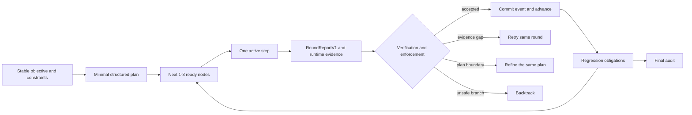

# LoopForge

LoopForge is a governance runtime for long-horizon AI coding tasks. It keeps
the objective, hard constraints, near-term plan, evidence, approvals, and
recovery state outside the coding Agent's conversation.

The Agent still investigates the repository, makes engineering decisions,
edits files, and runs tests. LoopForge gives that work a durable control loop:
one active step, one fenced round, evidence-gated advancement, and a final
audit before completion.

> Current worktree: `3.0.0` (unreleased) | Node.js 18+ | zero runtime dependencies | [中文](./README.zh-CN.md)

## Why LoopForge exists

Long coding tasks often outlive one context window or one process. If the task
only lives in chat, compression can drop a constraint, a failed check, or the
reason behind a decision. The Agent may also finish a local change and mistake
that result for completion of the whole task. A bad intermediate result can
then shape every later round.

LoopForge keeps the governing facts in typed JSON and recompiles each prompt
from that state. A round report cannot advance the workflow until runtime
evidence, plan claims, and enforcement rules agree. Rejected attempts commit
nothing. Restarts and backtracks reconstruct the same approved task state
without treating a conversation summary or Markdown file as truth.

This is the product boundary:

```text
objective and hard constraints
-> versioned near-term plan and risk approval
-> one active step and fenced round
-> normalized evidence and verification
-> retry, refinement, backtrack, or next step
-> regression checks and final audit
```

LoopForge does not provide a model, a background Agent, unattended execution,
code-level planning, automatic memory discovery, or a graph scheduler.

## How the control loop works


```mermaid
flowchart LR
    A["Stable objective and constraints"] --> B["Minimal structured plan"]
    B --> C["Next 1-3 ready nodes"]
    C --> D["One active step"]
    D --> E["RoundReportV1 and runtime evidence"]
    E --> F{"Verification and enforcement"}
    F -->|accepted| G["Commit event and advance"]
    F -->|evidence gap| H["Retry same round"]
    F -->|plan boundary| I["Refine the same plan"]
    F -->|unsafe branch| J["Backtrack"]
    G --> K["Regression obligations"]
    K --> C
    K --> L["Final audit"]
```

Planning does not consume an engineering round. Each accepted execution round
has one server-derived `activeStepId`. A rejected attempt keeps the same
logical `roundId`, increments its attempt number, and commits no task state.
Only an auditing `completed` report can complete the loop.

### The plan is stable where it matters

New sessions use `planningProfile: "minimal"` by default. The first plan fixes
the global objective, hard constraints, success criteria, current stage, and
the next one to three ready executable or outline nodes. The Agent does not
need to invent a detailed 50-step implementation before touching the code.

Later updates refine the same versioned plan. They do not create an unrelated
phase plan. A new executable step can identify the outline it expands with
`refinesStepId`. `dependsOn` records a real artifact, decision, gate, or
serialized resource dependency. It is not a presentation-order field.

`planningProfile: "full"` is available when the known topology matters up
front, such as migrations, production changes, security work, or coordinated
changes across several services.

### Approval follows impact

LoopForge derives the impact of every plan revision from the server-side diff:

| Impact | Typical change | Default `risk_only` behavior |
| --- | --- | --- |
| `none` | Normalized plan is unchanged | Continue |
| `tactical` | Title or low-risk scope refinement, normal outline expansion | Continue |
| `contract` | Objective, criteria, constraints, dependencies, or evidence contract changed | Require approval |
| `risk` | High-risk tags or inferred production, credential, migration, external-effect, or public-API scope changed | Require approval |

Use `approvalPolicy: "every_revision"` when a user wants to review every
non-empty plan revision. Fixed high-risk changes always require an exact
`approvalId` and `planVersion`.

Invalid plans return structured diagnostics for unknown dependencies, cycles,
uncovered criteria or constraints, missing acceptance or evidence, invalid
refinement, stale versions, completed-step mutation, risk inheritance, and the
absence of a ready node. A failed plan submission creates no plan revision,
does not increment `planVersion`, and consumes no engineering round.

### Evidence moves the task forward

`loopforge_next` accepts the returned `sessionId`, exact `roundId`, and a
compact `RoundReportV1`. The Agent reports facts established in the round. The
server derives the active step, expected claims, progress, and next action.

Claim IDs have distinct roles:

| Claim | Meaning |
| --- | --- |
| `ac-*` | Active-step acceptance criterion |
| `er-*` | Active-step evidence requirement |
| `cr-*` | Global success criterion for final audit |
| `ro-*` | Regression obligation derived from an earlier verified check |

A completed executable step must prove all of its `ac-*` and `er-*` claims.
Verified checks associated with accepted `er-*` claims can become `ro-*`
obligations. Later completed steps and the final audit must show that those
checks still pass. Failed, unavailable, not-run, or contradicted regression
evidence produces a focused retry.

The Agent does not submit a subjective progress percentage or choose the next
main step. Material advancement comes from new verified claims, meaningful Git
changes, improved checks, valid discoveries, or a step transition. Repeated
summaries and unchanged dirty files do not count. A failed investigation can
still advance the task when its eliminated assumption or newly established
fact is reported as a structured discovery. `noChangeReason` alone is context,
not progress. The configurable stall window defaults to three accepted
`in_progress` rounds for the same active step.

### Prompts recover state without re-planning every round

LoopForge creates one deterministic `PromptArtifact` per attempt. The active
step remains stable while prompts carry only the context needed for the next
decision:

- `step_start` contains the active-step contract and its bounded graph slice.
- `step_continue` contains new evidence gaps, discoveries, and changed facts.
- `step_retry` focuses on the rejection reason and repair evidence.
- `refine_plan` pauses code changes and describes the plan boundary.
- `audit` aggregates global criteria, gates, required commands, and regression obligations.

The governance graph behind these slices is a deterministic, read-only
projection of plans, workflow events, rounds, attempts, evidence, approvals,
and backtracks. It is never persisted as a second source of truth and never
executes or schedules nodes.

## Ownership boundary

| Coding Agent | LoopForge |
| --- | --- |
| Read code and investigate the repository | Persist the objective and hard constraints |
| Choose implementation details | Validate and version the structured plan |
| Edit files and run commands | Fence one active step and logical round |
| Make domain-specific engineering decisions | Normalize and cross-check evidence |
| Report facts, blockers, and discoveries | Accept, reject, refine, backtrack, or stop |
| Ask the user for decisions | Recompile prompts and preserve the audit trail |

LoopForge can collect configured Git and command evidence, but it does not
interpret the codebase or decide how a function should be implemented. Its
verification proves provenance, internal consistency, constraint compliance,
and workflow closure; it does not prove domain-level semantic correctness.
Git evidence proves the identity and content state of reported files, not that
their behavior is correct. Required commands and `ro-*` obligations still need
runtime-verified passing checks.

## When to use it

LoopForge is useful when a task spans several rounds or sessions, touches many
modules, has safety or compatibility constraints, needs explicit test or
external gates, or needs an auditable recovery path.

Skip it for a small bug, single-file edit, one-off script, code explanation,
copy change, or open-ended exploration whose objective is still changing. The
governance cost should be reserved for work that benefits from durable state
and evidence gates.

## Quickstart

The `3.0.0` package has not been published yet. To run the current repository:

```bash
cd loopforge
npm ci
npm run build
npm link

# Install the skill without changing the MCP client configuration.
loopforge init --client codex
loopforge init --client claude

# Registration is an explicit, separate action.
loopforge init --client codex --register
loopforge init --client claude --register
```

After publication, `npm install -g loopforge` replaces the repository build
and `npm link` steps.

Registration can be pinned to one workspace and Store:

```bash
loopforge init --client codex --register --workspace /absolute/project
loopforge mcp --workspace /absolute/project --store-dir .loopforge
```

In Codex or Claude Code, invoke `$loopforge` for a suitable long-running task.
A new task calls `loopforge_start` with an absolute `workspaceRoot`. Recovery
calls `loopforge_resume` with both `loopId` and `workspaceRoot`.

Follow the returned `requiredAction`:

| Action | Agent response |
| --- | --- |
| `submit_plan` | Inspect the repository without editing, then submit the structured plan. |
| `approve_plan` | Present the exact version, scope, risk, and impact to the user. |
| `execute_prompt` | Execute only the active step and its direct verification. |
| `resubmit_round` | Correct the same logical round. |
| `restore_workspace` | Restore the workspace described by the backtrack prompt. |
| `refine_plan` | Replace the plan against the exact `baseVersion`. |
| `execute_audit` | Verify all criteria, constraints, commands, gates, and regression obligations. |
| `none` | Stop because the workflow is terminal or no action remains. |

## MCP surface

LoopForge exposes 12 tools and does not add a one-time workspace tool:

| Tool | Purpose |
| --- | --- |
| `loopforge_start` | Bind the workspace and start planning or validate a supplied plan. |
| `loopforge_plan_submit` | Validate and version the initial plan. |
| `loopforge_plan_update` | Replace the plan against an exact base version. |
| `loopforge_plan_approve` | Approve or reject an exact pending version. |
| `loopforge_next` | Submit the fenced execution or audit report. |
| `loopforge_status` | Inspect workflow state, progress, evidence gaps, and runtime binding. |
| `loopforge_pause` | Persistently pause a running session. |
| `loopforge_resume` | Recover a session or resolve one exact external gate. |
| `loopforge_replay` | Read the timeline and derived governance graph. |
| `loopforge_health` | Inspect alignment, integrity, stall risk, and readiness. |
| `loopforge_list` | List compatible and incompatible sessions for the bound workspace. |
| `loopforge_stop` | Intentionally terminate a session. |

Start and resume return `capabilityPreflight`, which reports the server and
report versions, tool count, workspace and Store binding, and Git/command
evidence capability. A successful call proves that the current host session
actually exposes LoopForge. `doctor` can verify installation and registration,
but it cannot prove that MCP tools are loaded in the current conversation.

## Workspace, evidence, and recovery

An MCP process starts unbound unless `loopforge mcp --workspace` pre-binds it.
The first successful start or resume binds a canonical workspace and Store.
The process cannot switch them until restart. Relative Store and state paths
resolve from the bound workspace, not the process working directory.

Command evidence is disabled by default. Workspace-configured commands use an
executable plus argument array with `shell: false`, remain inside the bound
workspace, and require explicit host authorization through
`LOOPFORGE_ALLOW_WORKSPACE_COMMANDS=1`. Without that authorization, preflight
reports `commandEvidence: "blocked"` and starts no workspace subprocess.

Recovery refuses corrupt or incomplete typed state. It does not scan the disk
or recover from Markdown. The non-authoritative
`~/.loopforge/store-index.json` records known workspace and Store identities
only. It never stores loop IDs, objectives, prompts, constraints, or evidence.

## Durable state and compatibility

Typed JSON is the only durable truth:

```text
.loopforge/
  loops/<sha256(loopId)>/
    metadata.json
    session.json
    rounds/<round>.json
  state/<loopId>-state.md   # optional rebuildable projection
  migrations/
```

Plans, revisions, approvals, evidence envelopes, transactions, and workflow
events stay in the existing session and round documents. Regression
obligations, progress, graph views, diagnostics, and Markdown state are derived
from those documents.

This is the first public release. Pre-release schema 1/2 or missing-workflow
sessions remain unchanged on disk, appear under `incompatibleSessions`, and
cannot be resumed. `loopforge migrate` only imports an explicitly selected
PromptCraft vault. It does not upgrade sessions or delete its source.

## CLI and library surface

```text
loopforge mcp [--workspace DIR] [--store-dir DIR]
loopforge init --client claude|codex|generic [--target DIR] [--register] [--force] [--workspace DIR] [--store-dir DIR]
loopforge doctor [--workspace DIR] [--store-dir DIR] [--client claude|codex] [--workflow] [--json]
loopforge inspect LOOP_ID [--workspace DIR] [--store-dir DIR] [--round N] [--prompt] [--json]
loopforge migrate [--workspace DIR] [--store-dir DIR] [--from PATH] [--json]
```

The root package exports version information, supported plan/report/workflow
types, pure validators, stable claim-ID helpers, and read-only replay. Engine,
Compiler, SessionManager, and normalized internal evaluation types are not
public APIs. Supported package paths are:

```text
loopforge
loopforge/mcp
loopforge/replay
```

## Development

```bash
cd loopforge
npm run check
npm test
npm run build
npm pack --dry-run --json
git diff --exit-code -- dist ../loopforge-protocol.json
```

Edit `loopforge/src/protocol.ts`, then build to regenerate
`loopforge-protocol.json`. The generated schema and `dist/` are tracked release
artifacts.

See the [package README](./loopforge/README.md) and
[changelog](./loopforge/CHANGELOG.md) for package and release details.

## License

MIT
