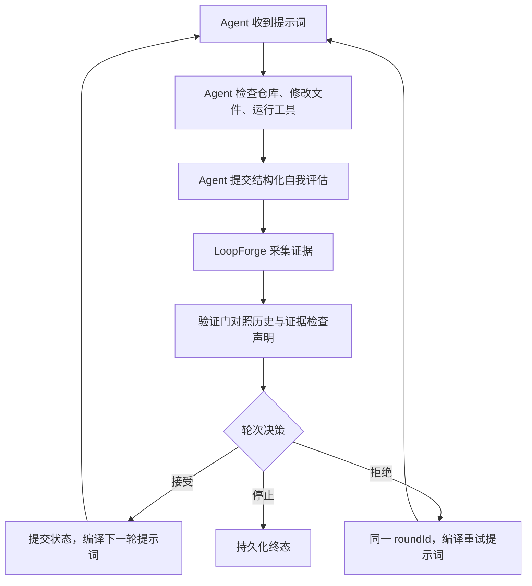

# LoopForge

[English](./README.md) | [npm 包文档](./loopforge/README.md) | [协议 Schema](./loopforge-protocol.json)

**面向 AI 编码 Agent 的可恢复认知状态运行时。**

AI 编码 Agent 擅长单轮任务，但多轮会退化：目标被压缩、约束消失、失败方案被重试、Agent 在缺乏证据时宣布完成。上下文窗口重置可能抹掉唯一一份连贯的计划。

LoopForge 存在的原因是：**跨轮状态管理是运行时问题，不是提示词问题。** 你不可能靠写更聪明的 prompt 来解决上下文坍缩。

> **v2.0.1** — `npm install loopforge`。MCP 服务（9 工具）+ 库 API + 验证门（10 项检查）+ 执行门（5 条规则）+ EvidenceProvider 证据接口（Git + Command）+ 暂停/恢复 + L0/L1/L2 提示词密度。零运行时依赖。271 个测试。Node.js ≥18。

---

## 设计理念

**Agent 拥有执行权。LoopForge 拥有轮次边界。**

这是最根本的分工。外部 Agent 读代码、改文件、跑工具、决定怎么推理。LoopForge 在模型上下文之外维护一份类型化、可验证的认知状态——并在每一轮边界强制执行它。

从这个分工出发，有四个设计原则：

### 1. 一份规范状态，一份派生视图

目标、约束、成功标准、证据、决策、进度、纠错记录和恢复数据全部存放在同一个类型化状态模型里。Markdown 状态文件只是一个人类可读的投影——它可以被重新生成、删除或关闭，永远不能变成第二份恢复真相。

### 2. 验证门 —— 跨轮一致性检查

每一轮结束后，验证门将 Agent 的自我评估与已提交历史和采集的证据进行对照。十项检查在反馈被提交前执行：

- **进度回退**：进度估计下降超过 0.2 且无解释 → 警告
- **空成功**：声明成功、测试全过，但没有任何文件变更 → 警告
- **提前完成**：仍有成功标准未完成，却把 `success` 设为 `true` → **错误**
- **重复发现**：将已知约束再次报告为"新发现" → 警告
- **反复违规**：同一约束连续三轮被违反 → **错误**
- **即发即撤**：刚发现的约束下一轮马上撤回 → 警告
- **文件诚信**：Agent 报告的 `files_changed` 与 Git 证据不符 → 警告
- **命令证据不匹配**：Agent 报告的 `test_results` 与实际测试运行器输出不一致 → 警告（隐藏失败 → **错误**）
- **必须命令失败**：声明成功但 `required` 验证命令失败 → **错误**

结论汇总为 `trusted`、`suspect` 或 `contradicted`。警告以提示形式进入下一轮。矛盾（任何 error 级别标记）会在反馈提交前被拦截。

### 3. 执行门 —— 硬轮次边界决策

验证门指出哪里不一致，执行门决定下一步。当前规则：

- **R1 虚假成功**：`success: true` 但仍有未完成标准 → **拒绝**
- **R2 反复违规**：同一约束在多轮尝试中被违反 → **拒绝**
- **R3 空洞成功**：声明成功但无文件变更、无测试证据 → **拒绝**
- **R4 进度停滞**：连续多轮进度无变化 → **拒绝**
- **R5 最大拒绝次数**：反复被拒且无法解决 → **终止循环**

拒绝保持同一个逻辑 `roundId`，只增加 attempt 计数，且**不提交任何内容**——不更新成功轨迹、不修改约束历史、不写入滚动摘要。Agent 收到一份说明具体需要修复什么的拒绝提示词，重新执行同一轮。这个零提交规则是防止评估污染的核心防线：一次糟糕的轮次不能毒化未来的提示词。

### 4. 证据来自工作区，不来自提示词

LoopForge 在轮次边界采集证据，以此回答"Agent 真的做了它所声称的事吗？"

**Git 证据**（默认启用）：在每轮前后对 tracked、staged、untracked 文件做快照并对比。即使某文件在本轮开始前已经是脏文件，本轮再次修改或恢复它也能被识别。

**命令证据**（在 `loop_policy.json` 中显式配置）：测试运行器、linter、类型检查或构建工具以 `shell: false` 运行，工作目录经过边界检查，每条命令有独立截止时间和输出上限（硬限制 20k 字符）。标记为 `required` 的命令失败、超时或缺失时，直接推翻 Agent 的成功声明。命令提供者还会解析测试运行器输出（Jest、Mocha、pytest、Go test、PHPUnit），将解析出的计数与 Agent 报告的 `test_results` 做交叉验证——能捕获 Agent 声称"全部通过"但运行器实际显示失败的情况。

---

## 一次循环如何运行



每个轮次有稳定的 `roundId`。轮次决策被持久化，因此进程重启后恢复不会把同一轮推进两次。

提示词级别（L0/L1/L2）只控制**状态密度**：向 Agent 注入多少规范状态。L0 是拒绝重试，L1 是常规推进，L2 是首轮或完整恢复。这些级别不选择推理技术——推理始终属于 Agent。

**恢复是内置机制，不是后期补丁。** 每一轮事务在下一轮提示词交付前持久化。无论 Agent 上下文被压缩、MCP 进程重启还是用户主动暂停，`resume` 都能从类型化 JSON 重建 session 并返回正确的提示词——不会把同一轮推进两次。`replay` 可查看完整已提交时间线用于审计；`health` 检查目标对齐、约束完整性和跨轮漂移。

---

## 快速开始

```bash
git clone https://github.com/kyrielrving11/LoopForge.git
cd LoopForge/loopforge
npm install
npm run build
npm link
loopforge doctor
```

或从 npm 安装：

```bash
npm install -g loopforge
loopforge init --client claude
claude mcp add loopforge -- npx loopforge mcp
```

---

## MCP 服务（Agent 驱动）

Agent 通过 MCP 调用 LoopForge 工具。LoopForge 提供每一轮的提示词，验证每一次评估，并持久化状态。Agent 仍是执行主体——LoopForge 不实现 MCP Tasks，不在后台运行 Agent。

```bash
loopforge init --client claude
claude mcp add loopforge -- npx loopforge mcp
```

### 九个 MCP 工具

| 工具 | 用途 |
|------|------|
| `loopforge_start` | 启动循环 — 从任务 + 约束编译第 1 轮 prompt |
| `loopforge_next` | 提交自我评估 → 获取下一轮 prompt（或 `null` + 停止原因） |
| `loopforge_status` | 当前轮次、成功轨迹、活跃技术 |
| `loopforge_pause` | 暂停运行中的循环 — 状态持久化到 vault，稍后可恢复 |
| `loopforge_resume` | 暂停或进程重启后从 vault 恢复循环 |
| `loopforge_stop` | 手动停止，最终轨迹被保留 |
| `loopforge_list` | 所有活跃会话（内存 + vault 持久化） |
| `loopforge_replay` | 完整时间线：轮次、决策、成功标记 |
| `loopforge_health` | 目标对齐、约束完整性、漂移、策略稳定性 |

每个工具结果包含类型化 `structuredContent`。输入在服务端严格验证。拒绝提示词返回同一轮——Agent 在不推进轮次的情况下重做。

### 自我评估（Agent 每轮报告的内容）

评估作为结构化 MCP 工具参数传递——由 MCP 客户端在到达服务器之前校验。

```json
{
  "success": true,
  "output_summary": "修复了 3 个重入漏洞。24/24 测试通过。",
  "constraint_violations": [],
  "should_continue": true,
  "discovered_constraints": ["所有外部调用必须使用 SafeERC20"],
  "objective_refinement": "范围扩大：权限控制问题属于可升级代理模式的一部分",
  "emerged_subtasks": ["审计代理初始化流程", "验证 timelock 参数"],
  "execution_evidence": {
    "files_changed": ["contracts/Token.sol", "test/Token.test.ts"],
    "test_results": {"passed": 24, "failed": 0, "skipped": 0},
    "success_criteria_met": ["无重入向量残留"],
    "success_criteria_remaining": ["权限控制已验证", "溢出检查已完成"],
    "progress_estimate": 0.4
  },
  "retracted_constraints": [],
  "revised_success_criteria": [],
  "wrong_assumptions": [],
  "worker_results": []
}
```

每个字段都有明确的下游消费者——没有装饰字段。

---

## 持久化存储

类型化 JSON 存放在 `.loopforge/loops/<sha256(loopId)>/` 下。Session 和轮次文档是持久事务真相。写入使用临时文件加 rename 的原子方式。Store lock 保护写入；可续期 session lease 隔离并发 MCP 进程。

```text
.loopforge/
  loops/<sha256(loopId)>/
    metadata.json   session.json   rounds/1.json   rounds/2.json
  state/<loopId>-state.md   （可选派生视图）
```

---

## 重编译级别

| 级别 | 触发条件 | 行为 |
|------|---------|------|
| **L0 重试** | 执行门拒绝 | 同一 roundId、同一任务 — prompt 包含拒绝原因和修复指示 |
| **L1 继续** | 默认 — 所有正常轮次 | 瘦 prompt：任务 + 增量 + 验证标记。状态存在于派生状态文件中 |
| **L2 重启** | 第 1 轮、恢复、检查点边界 | 完整 prompt：任务 + 目标 + 全部约束 + 滚动摘要 + 进度面板 |

---

## 核心特性

### 认知演化
- **约束发现（P0）** — Agent 在执行中发现新的护栏。自动合并到活跃约束集。
- **目标深化（P1）** — 理解随轮次加深。目标拥有版本链——追加，永不替换。
- **子问题涌现（P2）** — 子问题有机浮现。无需预先规划即可注入下一轮任务建议。
- **执行证据（P4）** — 结构化报告：文件变更、测试结果、标准满足/剩余、进度估算。
- **进度追踪（P4）** — 客观 vs 主观进度双重度量 + 梯度检测。在断路器触发前提前预警停滞。
- **自我纠正（P5）** — 撤回错误约束、修正不合理成功标准、标记被推翻的假设。

### 验证门（10 项检查）
跨轮自评验证，对照 lineage 和证据。三级判决：`trusted` → 正常流转；`suspect` → 警告注入下一轮 prompt；`contradicted` → 成功标志从趋势中排除，🚫 标记成为硬约束。

### 执行门（5 条规则）
硬轮次边界决策。拒绝无效自评（Agent 必须重做同一轮）、终止不可恢复的循环。在状态变更前运行，被拒绝的轮次不会污染 vault。

### 证据提供者
轮次边界的可插拔证据采集。内置提供者：Git（tracked/staged/untracked 文件检测，带指纹比对）和 Command（无 shell 的测试运行器/linter 执行，与 Agent 报告结果交叉验证）。通过 `loop_policy.json` 配置。

### 暂停/恢复
轮次边界优雅暂停。状态持久化到 vault——会话可跨进程重启存活。支持从暂停和崩溃两种状态恢复。

### 会话租约
可续期、带 epoch 追踪的租约机制防止并发 MCP 进程推进同一 loop。通过 `signal 0` + 过期锁超时检测 dead owner。

### 其他
- **L0/L1/L2 提示词密度** — 只控制状态密度，不控制推理策略
- **熔断器** — 连续失败检测，阈值可配置
- **Replay 引擎** — 时间旅行查询：时间线、对比、轮次级审计
- **策略外置** — 所有可调参数在 `loop_policy.json`
- **结构化可观测性** — 事件日志（`LOOPFORGE_LOG=1`）+ 策略指标统计
- **零运行时依赖** — 仅 Node.js 标准库，TypeScript strict mode

---

## 运行边界

- LoopForge **不**沙箱化外部 Agent。工具权限属于 Agent 宿主。
- 命令证据固定 `shell: false`。配置的 executable 本身必须可信。
- 路径越界（词法 + 真实路径，包括 symlink/junction）在每次命令执行和状态文件写入时检查。
- Store lock 和 session lease 防止意外并发推进，不是分布式一致性系统。
- CLI 默认隐藏提示词文本。
- 运行时零依赖。使用前应审阅包内容和策略配置。

---

## 项目结构

```
LoopForge/
├── loopforge/                 # TypeScript 包
│   ├── src/
│   │   ├── backends/          # VaultBackend 接口
│   │   ├── mcp/               # MCP 服务器、会话管理器、工具
│   │   ├── tests/             # 271 个测试（Node.js 内置 runner）
│   │   ├── canonical-state.ts # 类型化认知状态 + 确定性哈希
│   │   ├── cli.ts             # 统一 loopforge 命令行
│   │   ├── engine.ts          # Session 状态持有 + 编译调度 + 反馈持久化
│   │   ├── enforcement-gate.ts# 5 条执行规则
│   │   ├── evidence-provider.ts# Git + Command 证据采集
│   │   ├── interop.ts         # 跨生态 checkpoint 桥接（实验性）
│   │   ├── loop-compiler.ts   # 状态演化 + 提示词编译
│   │   ├── loop-store.ts      # 类型化 per-loop JSON 持久化
│   │   ├── observability.ts   # 结构化追踪
│   │   ├── policy-metrics.ts  # 验证 + 轮次结果指标
│   │   ├── policy.ts          # 策略加载 + 状态文件 I/O
│   │   ├── prompt-assembler.ts# 单 pass 提示词渲染器
│   │   ├── prompt-policy.ts   # L0/L1/L2 视图选择
│   │   ├── protocol.ts        # 全部类型 + 工厂函数
│   │   ├── replay.ts          # 轮次时间线 + diff 查询
│   │   ├── round-coordinator.ts# 验证 → 执法 → 停止管线
│   │   ├── round-driver.ts    # 编译 + 证据 + 事务胶水
│   │   ├── round-transaction.ts# 带 schema 版本号的轮次提交/重放
│   │   ├── self-eval.ts       # 自我评估提取 + 解析
│   │   ├── storage.ts         # Session + 轮次持久化适配器
│   │   └── verification-gate.ts# 10 项跨轮一致性检查
│   ├── dist/                  # 编译产物 + 类型声明
│   └── loop_policy.json       # 默认策略
├── loopforge-protocol.json    # JSON Schema (draft 2020-12)
└── README.md / README.zh-CN.md
```

---

## API 模块

| 导入路径 | 用途 |
|----------|------|
| `loopforge` | `createEngine()`、`LoopForgeEngine`、`McpServer`、`SessionManager`、全部类型 |
| `loopforge/compiler` | `compileLoop()`、`decideLevel()`、`buildSelfEvalBlock()` |
| `loopforge/replay` | `ReplayBackend` — `replay()`、`timeline()`、`diff()` |
| `loopforge/mcp` | `McpServer`、`SessionManager` — JSON-RPC 传输 + session 生命周期 |

---

## 许可证

MIT
