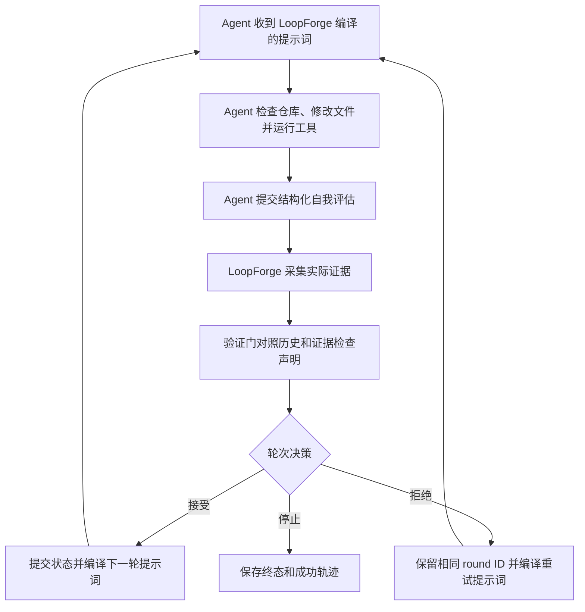

# LoopForge

**面向 AI 编码 Agent 的可恢复认知状态运行时。**

[English](./README.md) | [npm 包文档](./LoopForge/README.md) | [协议 Schema](./loopforge-protocol.json)

AI 编码 Agent 很擅长完成边界清楚的单次任务。任务一旦持续很多轮，问题就不只是能不能写出代码了。原始目标可能在上下文压缩后变形，新发现的约束可能没有进入下一轮，已经失败的方案可能被再次尝试，Agent 也可能在仓库证据不足时过早宣布完成。如果进程中断，唯一一份可用计划还可能跟着聊天上下文一起丢失。

LoopForge 给 Agent 增加了一个持久的轮次边界。它把目标、成功标准、约束、证据、决策、进度、纠错记录和恢复状态保存在模型上下文之外。读取仓库、修改文件、运行命令和选择推理方式的仍然是外部 Agent，LoopForge 负责让这些工作在多轮执行中保持连贯，并能在中断后恢复。

npm 包位于 [`LoopForge/`](./LoopForge/)，要求 Node.js 18 或更高版本，全部使用 TypeScript，运行时零依赖。

## LoopForge 解决哪些问题

当任务的历史信息已经会影响后续判断时，LoopForge 开始发挥作用：

- 仓库审计需要依次覆盖架构、正确性、安全、测试、文档和发布检查。
- 大型重构要在很多次修改中持续遵守公共 API、兼容性和依赖边界。
- 迁移做到一半才发现新的约束，原计划必须随证据调整。
- 疑难缺陷需要验证多个假设，并记住哪些思路已经被证伪。
- Agent 可能经历上下文压缩、主动暂停、进程重启或跨会话继续。
- 完成声明必须和 Git 变化、测试、构建或类型检查结果相互印证。
- 团队需要知道每轮做了什么、学到了什么、为什么被拒绝，以及最终提交了哪些状态。

只有一轮就能完成的小任务通常不需要 LoopForge。它更适合那些一旦丢失历史、约束或证据，结果就会发生变化的任务。

## LoopForge 和外部 Agent 如何分工

| LoopForge 负责 | 外部 Agent 负责 |
| --- | --- |
| 保存规范目标和持续演化的认知状态 | 阅读源码、文档和项目结构 |
| 根据已提交状态编译下一轮提示词 | 选择推理方法和工具 |
| 采集 Git 和显式配置的命令证据 | 修改文件并运行命令 |
| 跨轮验证 Agent 的自我评估 | 提交诚实的结构化评估 |
| 接受、拒绝或终止一个轮次 | 按拒绝要求重做当前轮次 |
| 持久化轮次事务和恢复数据 | 判断何时需要用户输入或授权 |
| 提供暂停、恢复、回放、健康检查和审阅 | 始终作为用户任务的执行主体 |

LoopForge 不是模型、编码 Agent、任务调度器或无人值守执行器。它不会在后台再创建一个 Agent。已经连接到用户仓库的客户端 Agent 继续拥有执行权，LoopForge 只管理它的状态和轮次事务。

## 一次循环如何运行



每个逻辑轮次都有稳定的 `roundId`。如果执行门拒绝当前尝试，LoopForge 只增加 attempt，不推进轮次，也不提交这次反馈。接受后，规范状态只更新一次。轮次决策本身会持久化，所以进程重启后再次恢复不会把同一轮推进两次。

## 核心能力

### 规范认知状态

LoopForge 只维护一份类型化认知状态。提示词和面向人类的状态文件都从它生成，避免两套事实源逐渐分叉。状态包含：

- 原始目标、目标版本和历次目标修订。
- 成功标准以及仍未完成的标准。
- 硬约束、当前有效约束和已退休约束。
- 上一轮接受后发生的变化。
- 新发现、派生子任务、阻塞项和错误假设。
- 进度估计、修改文件和测试结果。
- 跨轮结果、重复问题和失败模式。
- 验证标记、检查点、下一步动作和外部上下文。

Markdown 状态文件只是派生视图，不参与恢复兜底，因此不会悄悄变成另一份事务真相。

### 每次尝试只生成一个提示词产物

每次尝试都会产生一个不可变的 `PromptArtifact`。它保存实际交付给 Agent 的提示词，同时记录提示词哈希、规范状态哈希、round ID、attempt、状态级别、包含的章节、字符预算和生成时间。审阅者可以据此确认某个提示词由哪一份状态生成，也能判断两个尝试是否收到了相同指令。

L0、L1、L2 只控制注入多少状态：

| 级别 | 触发时机 | Agent 收到的内容 |
| --- | --- | --- |
| L0 | 当前尝试被拒绝，需要重做同一逻辑轮次 | 拒绝原因、修复要求以及本次尝试新增的信息 |
| L1 | 常规继续执行 | 当前任务、约束、进度和下一步动作组成的紧凑状态胶囊 |
| L2 | 首轮、检查点、目标变化或完整刷新 | 恢复任务所需的完整规范状态 |

这些级别不选择思维链、树搜索或其他提示词技巧。如何推理始终由 Agent 决定。

### 跨轮验证

验证门会把当前自我评估和已经提交的历史、Git 状态及其他证据进行对照。当前能够发现：

- 进度出现较大回退，但没有相应解释。
- Agent 声明成功、测试通过，却没有任何文件变化。
- 仍有成功标准未完成，却把 `success` 设为 `true`。
- 把已经知道的约束再次报告为新发现。
- 同一约束连续三轮被违反。
- 刚发现的约束在下一轮马上被撤回。
- Agent 报告的修改文件和 Git 证据不一致。
- Agent 报告的执行证据和 provider 快照不一致。
- 必须通过的验证命令失败、超时、缺失或工作目录非法。

这些发现会汇总为 `trusted`、`suspect` 或 `contradicted`。警告可以进入下一轮提示词，矛盾则会在反馈提交之前交给执行门处理。

### 轮次执行门

验证门负责指出哪里不一致，执行门负责决定下一步。当前规则会拒绝虚假完成、重复违反约束、没有可核验证据的成功声明和连续停滞。Agent 在拒绝后仍不能解决问题时，LoopForge 可以用 `enforcement_terminated` 终止循环。

被拒绝的尝试不会写入成功轨迹、约束历史、滚动摘要或正式轮次结果。这个零提交规则可以防止一次无效评估污染后面的提示词。

### 采集仓库中的真实证据

Git 证据默认启用。LoopForge 在轮次边界采集 tracked、staged 和 untracked 文件的状态，并比较执行前后的快照。即使某个文件在本轮开始前已经是脏文件，本轮再次修改或恢复它也能被识别。

命令证据需要显式配置。项目可以把测试、构建、lint、类型检查或其他可执行程序设为验证来源。命令执行具有以下边界：

- 使用 executable 和 args 数组，固定 `shell: false`。
- 工作目录经过词法路径和真实路径检查，必须留在工作区内。
- 每条命令都有截止时间，超时后终止子进程。
- 保留的输出有长度上限，硬上限是 20,000 个字符。
- 返回 `passed`、`failed`、`timeout`、`missing`、`invalid_cwd` 或 `aborted` 等结构化状态。
- 命令可以标记为 `required`，失败时会直接推翻 Agent 的成功声明。

### 持久恢复和进程所有权

默认 `FileLoopStore` 使用临时文件加 rename 的方式写入类型化 JSON。loop ID 会先映射为 SHA-256 目录名，避免前缀碰撞和不安全的路径拼接。全局 store lock 保护写入，可续期的 session lease 防止两个 MCP 进程同时推进同一循环。

运行中和已暂停的 session 都能在 MCP 进程重启后重建。pause 会保留当前事务，resume 会返回正确的提示词而不重置进度，stop 和清理路径也保持幂等。

### 回放、审阅、健康检查和 tracing

LoopForge 保存已提交时间线，方便调试和审计。用户可以检查 session、读取指定轮次、查看进度变化和回放决策，不需要依赖 Agent 当前还记得多少内容。CLI 默认隐藏完整提示词，只有显式传入 `--prompt` 才会显示。

运行时还提供结构化 tracing、策略效果指标、终态事件 sink、外部上下文 provider、认知检查点 sink、自定义证据 provider 和自定义 `LoopStore` 等扩展点。

## 从当前仓库开始使用

```bash
git clone https://github.com/kyrielrving11/LoopForge.git
cd LoopForge/LoopForge
npm install
npm run build
npm link
loopforge doctor
```

`npm link` 会在开发候选版本时提供本地 `loopforge` 命令。如果使用已经发布的包版本，安装后运行同样的 CLI 命令即可。

安装 Perception Skill，并让 CLI 输出客户端注册命令：

```bash
# Claude Code
loopforge init --client claude
claude mcp add loopforge -- npx loopforge mcp

# Codex
loopforge init --client codex
codex mcp add loopforge -- npx loopforge mcp
```

其他 MCP 客户端可以运行：

```bash
loopforge init --client generic
```

generic 模式会把 Skill 安装到 `.loopforge/skills/perception/`，并输出标准 `mcpServers` 配置片段。使用 `--target DIR` 可以指定其他 Skill 目录，`--force` 可以覆盖已有副本。

存储根目录相对于 MCP 服务进程的工作目录。应当从需要管理循环状态的仓库启动服务，或在客户端配置中把工作目录设到该仓库。

## 让 Agent 使用 LoopForge

完成 MCP 注册后，可以直接要求 Agent 用 LoopForge 处理需要多轮完成的任务。任务描述最好同时给出目标和必须长期保留的边界：

```text
使用 LoopForge 审计这个 TypeScript 包，修复已经确认的正确性问题，
保持公共 API 不变，运行现有检查，继续执行到所有确认问题都已修复，
或者明确记录为 blocked。
```

Agent 会通过 MCP 启动 session：

```json
{
  "task": "审计这个 TypeScript 包并修复已经确认的正确性问题",
  "constraints": [
    "保持公共 API 不变",
    "保留运行时零依赖设计",
    "声明完成前必须运行现有检查"
  ],
  "maxRounds": 12,
  "domain": "typescript"
}
```

完成真实的仓库工作后，Agent 提交结构化评估：

```json
{
  "sessionId": "SESSION_ID",
  "evaluation": {
    "success": false,
    "output_summary": "修复了 resume 竞态并增加回归测试，进程重启后的恢复路径仍需验证。",
    "should_continue": true,
    "constraint_violations": [],
    "discovered_constraints": [
      "恢复后的 session 必须保留原始 round ID"
    ],
    "execution_evidence": {
      "files_changed": [
        "src/runtime.ts",
        "src/tests/runtime.test.ts"
      ],
      "test_results": {
        "passed": 18,
        "failed": 0,
        "skipped": 0
      },
      "success_criteria_met": [
        "pause 和 resume 不再创建第二个 driver"
      ],
      "success_criteria_remaining": [
        "验证进程重启后的恢复行为"
      ],
      "progress_estimate": 0.7
    }
  }
}
```

LoopForge 随后返回下一轮提示词、同一轮的拒绝提示词，或者终止原因。Agent 会继续留在当前用户任务中执行。

## MCP 工具

stdio 服务提供 9 个由 Agent 驱动的同步工具：

| 工具 | 主要输入 | 用途 |
| --- | --- | --- |
| `loopforge_start` | `task`，可选 `constraints`、`maxRounds`、`domain`、`loopId`、`planSource` | 创建循环并编译第 1 轮提示词 |
| `loopforge_next` | `sessionId` 和结构化 `evaluation` | 验证并结束当前尝试，然后返回下一轮提示词 |
| `loopforge_status` | `sessionId` | 查看轮次身份、状态、成功轨迹、lease 和指标 |
| `loopforge_pause` | `sessionId` | 在下一轮边界持久化并暂停 session |
| `loopforge_resume` | `loopId` | 重建被中断或主动暂停的 session |
| `loopforge_stop` | `sessionId` | 主动结束 session 并返回轨迹 |
| `loopforge_list` | 无 | 列出当前 MCP 服务知道的 session |
| `loopforge_replay` | `sessionId` | 返回可审阅的已提交时间线 |
| `loopforge_health` | `loopId` | 检查目标对齐、约束完整性、漂移、稳定性和任务连续性 |

工具结果同时包含 MCP `structuredContent` 和面向旧客户端的序列化文本。服务端会严格验证输入，primitive JSON 或字段错误的 evaluation 会返回工具错误，不会让 MCP 进程崩溃。

LoopForge 不实现 MCP Tasks。客户端 Agent 每完成一轮后，需要继续调用下一次工具。

## CLI 命令

```bash
loopforge mcp
loopforge init --client claude|codex|generic [--target DIR] [--force]
loopforge doctor [--json]
loopforge inspect LOOP_ID [--round N] [--prompt] [--json]
loopforge migrate [--from PATH] [--json]
```

| 命令 | 功能 |
| --- | --- |
| `mcp` | 通过标准输入输出启动 JSON-RPC MCP 服务 |
| `init` | 安装 Perception Skill，并输出客户端注册信息 |
| `doctor` | 检查 Node.js、存储权限、Git 和命令配置，但不会运行验证命令 |
| `inspect` | 读取 session 摘要或指定轮次文档，默认隐藏完整提示词 |
| `migrate` | 把旧 `.promptcraft/prompt_vault.json` 导入类型化存储，同时保留源文件 |

自动化脚本可以使用 `--json`。迁移操作是幂等的，完成后会在 `.loopforge/migrations/` 写入标记。

## 存储结构

```text
.loopforge/
  loops/
    <sha256(loopId)>/
      metadata.json
      session.json
      rounds/
        1.json
        2.json
  migrations/
  state/
    <loopId>-state.md
```

`metadata.json`、`session.json` 和各轮 JSON 文档是持久事务事实源。Markdown 文件是面向人和 Agent 的可替换视图。如果项目只需要类型化存储，可以关闭 `state_file.enabled`。

每个轮次文档可以保存稳定的事务快照、提示词产物、自我评估、验证 verdict、执行决策，以及审阅和回放所需的已提交 lineage。

## 配置验证命令

LoopForge 从工作目录读取 `loop_policy.json`。Git 证据默认启用，其他命令只有显式配置后才会执行：

```json
{
  "evidence": {
    "providers": ["git"],
    "timeout_ms": 120000,
    "commands": [
      {
        "name": "typecheck",
        "enabled": true,
        "executable": "npm",
        "args": ["run", "check"],
        "cwd": ".",
        "phase": "after",
        "required": true,
        "timeout_ms": 120000,
        "max_output_chars": 12000,
        "success_exit_codes": [0]
      }
    ]
  }
}
```

如果 Windows 环境要求显式使用命令 shim，可以把 executable 写成 `npm.cmd`。`loopforge doctor` 会检查命令名称、参数结构和工作目录，但不会实际运行命令。

其他策略项可以控制最大轮次、单轮截止时间、心跳与停滞时间、提示词预算、完整状态刷新间隔、状态文件、约束退休规则和 MCP lease 时间。完整默认值见 [`LoopForge/loop_policy.json`](./LoopForge/loop_policy.json)。

## 作为 TypeScript 库使用

已经拥有 Agent 执行器的项目可以直接嵌入运行时：

```typescript
import { run } from "loopforge";

const result = await run({
  task: "审计这个仓库并修复已经确认的问题",
  constraintsFromPlan: [
    "不得修改公共 API",
    "不得删除现有回归测试"
  ],
  maxRounds: 10,
  execute: async (prompt, context) => {
    return agent.execute(prompt, { signal: context.signal });
  },
  onRoundStart: ({ round, roundId, level }) => {
    console.log({ round, roundId, level });
  },
  onHeartbeat: ({ round, elapsedMs }) => {
    console.log(`round ${round}: ${elapsedMs}ms`);
  }
});

console.log(result.stopReason, result.successTrajectory);
```

外部上下文和终态遥测都通过显式接口接入：

```typescript
const result = await run({
  task,
  execute,
  contextProvider: async ({ loopId, round, lastEvaluation }) => {
    return contextStore.read({ loopId, round, lastEvaluation });
  },
  terminalSinks: [
    async (event) => telemetry.record(event)
  ]
});
```

公共包还导出了 compiler、runtime、replay backend、MCP server、`FileLoopStore`、证据 provider 注册表、命令证据 provider、tracing 接口、策略指标、认知检查点桥接和轮次事务原语。子路径导出包括 `loopforge/compiler`、`loopforge/replay` 和 `loopforge/mcp`。

## 能否处理长程任务

可以，前提是任务仍由 Agent 驱动，并且有一个有边界的目标。LoopForge 能让状态跨越多轮执行、上下文压缩、主动暂停和进程重启。默认策略允许 20 轮，也可以按 session 或策略文件调整。

适合长程执行的任务通常满足四个条件：

1. 一个 loop 只对应一个清楚的用户目标。
2. 硬约束和成功标准在开始时写明，只有新证据出现时才进行修订。
3. 每轮都完成真实工作并提交证据，而不是不断生成下一份计划。
4. 客户端 Agent 会继续执行后续提示词，或者由用户在之后主动恢复。

客户端任务结束后，LoopForge 不会让 Agent 自己留在后台运行。它不负责调度机器、管理凭据，也不会替代高风险操作所需的人工授权。自定义存储或检查点 sink 可以把它接入更大的平台，但执行所有权仍然位于 LoopForge 之外。

如果工作规模已经接近一整张路线图，可以为互相独立的目标建立多个 loop，再由 Agent 显式传递各 loop 的结果。不要把所有方向都塞进一个没有终点的 session。

## 适用场景

### 仓库审计和修复

把正确性、安全、兼容性和发布边界作为长期约束。每轮检查一个子系统，修复已经确认的问题，并记录尚未关闭的风险。Git 和命令证据保留审计记录，replay 可以解释某个结论为什么被接受、拒绝或暂缓。

### 带兼容约束的大型重构

把公共 API、包体积、运行时依赖和 Node.js 支持范围写入硬约束。实现过程中发现新的兼容边界时，通过 `discovered_constraints` 纳入后续状态。到达检查点后，L2 会把这些约束完整注入回来。

### 疑难问题排查

每轮摘要记录当前假设，把已经证伪的判断写入 `wrong_assumptions`。同一错误持续出现或进度长期不变时，执行门会要求改变方案，防止 Agent 无限制重复同一个实验。

### 迁移和发布准备

把 Schema 变化、兼容任务、文档、打包和验证命令列为成功标准。必须通过的 build 或 test 命令失败时，Agent 不能把发布准备声明为完成。

### 上下文不足或进程中断

主动 pause，或者在 MCP 进程重启后 resume。新的 Agent 会从类型化状态恢复，查看派生状态文件和历史轮次，并通过 L2 重新获得完整任务信息，不需要从聊天记录手工重建上下文。

## 安全和运行边界

- LoopForge 不会沙箱化外部 Agent，工具权限仍由 Agent 宿主管理。
- 命令证据不经过 shell，但配置的 executable 本身仍然必须可信。
- 命令和状态文件路径会检查词法边界与真实路径边界，包括 symlink 或 junction 越界。
- store lock 和 session lease 用来防止意外并发推进，不是分布式一致性系统。
- CLI 默认隐藏提示词，因为提示词可能包含仓库上下文。
- 运行时零依赖减少了安装后的攻击面，但使用前仍应审阅包内容和策略配置。
- 2.0 目前是候选版本，建议先在非关键任务中验证，再接入正式工作流。

## 开发和验证

```bash
cd LoopForge
npm run check
npm test
npm pack --dry-run --json
```

`npm test` 会编译 TypeScript、重新生成协议 Schema，并串行运行 Node.js 测试。根目录的 [`loopforge-protocol.json`](./loopforge-protocol.json) 由 `LoopForge/src/protocol.ts` 生成，不应手工修改。

npm 包包含编译后的运行时、Perception Skill、默认策略和类型声明。编译后的测试文件不会进入 npm 包。

## 2.0 兼容边界

2.0 删除了提示词技巧目录、策略关键词路由、MCP Tasks、自动 memory 发现、全局 PromptCraft vault、Markdown 恢复兜底和旧 `loopforge-mcp` 二进制入口。新版本统一使用 `loopforge` CLI、`loopforge mcp`、类型化 `FileLoopStore`、结构化评估和显式 provider。

旧 vault 可以迁移，源数据不会被删除：

```bash
loopforge migrate
loopforge migrate --from path/to/prompt_vault.json --json
```

## 项目方向

LoopForge 会继续聚焦 Agent 的可恢复、可审阅认知状态。近期方向是存储适配器、证据 provider、生态互操作、tracing 和真实客户端接入，不会把项目扩张成另一个模型宿主或后台 Agent 编排平台。

欢迎提交 issue、回归用例、provider 实现、客户端接入说明，以及真实多轮任务中的使用反馈。

## 许可证

MIT
