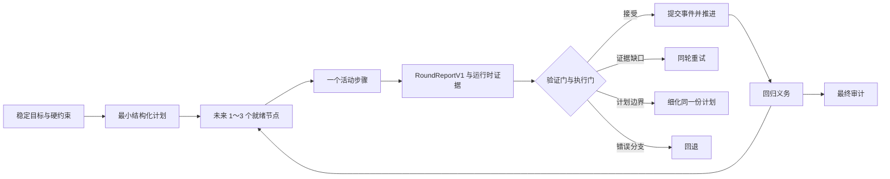

# LoopForge

LoopForge 是面向长程 AI 编码任务的治理运行时。它把总目标、硬约束、近程计划、证据、审批与恢复状态保存在编码 Agent 的对话之外。

Agent 仍然负责调研仓库、做工程判断、修改文件和运行测试。LoopForge 为这些工作提供可恢复的控制循环：每次只有一个活动步骤和一个受保护轮次，证据通过后才能推进，最终审计通过后才能完成任务。

> 当前工作树：`3.0.0`（尚未发布）| Node.js 18+ | 零运行时依赖 | [English](./README.md)

## LoopForge 解决什么问题

长程编码任务往往会跨越多个上下文窗口或进程。如果任务事实只存在于聊天记录中，上下文压缩可能丢掉一条约束、一次失败检查，或某项决策的原因。Agent 也可能完成局部修改后，把一个步骤的完成误认为整个任务已经完成。错误的中间结果一旦进入下一轮，后续工作会继续沿用它。

LoopForge 把治理事实写入 typed JSON，并从这些状态重新编译每次提示词。轮次报告只有在运行时证据、计划断言和执行规则一致时才能推进工作流。被拒绝的尝试不会提交状态。进程重启或回退后，系统会重建同一份已批准任务状态，不把聊天摘要或 Markdown 当作事实源。

产品边界可以概括为：

```text
总目标与硬约束
-> 版本化近程计划与风险审批
-> 一个活动步骤和一个受保护轮次
-> 证据归一化与验证
-> 重试、细化、回退或下一步骤
-> 回归检查与最终审计
```

LoopForge 不提供模型、后台 Agent、无人值守执行、代码级规划、自动记忆发现或图调度器。

## 控制循环如何工作


```mermaid
flowchart LR
    A["稳定目标与硬约束"] --> B["最小结构化计划"]
    B --> C["未来 1～3 个就绪节点"]
    C --> D["一个活动步骤"]
    D --> E["RoundReportV1 与运行时证据"]
    E --> F{"验证门与执行门"}
    F -->|接受| G["提交事件并推进"]
    F -->|证据缺口| H["同轮重试"]
    F -->|计划边界| I["细化同一份计划"]
    F -->|错误分支| J["回退"]
    G --> K["回归义务"]
    K --> C
    K --> L["最终审计"]
```

规划不占用工程轮次。每个已接受执行轮次只有一个由服务端确定的 `activeStepId`。被拒绝的尝试保留原逻辑 `roundId`，只增加 attempt，不提交任务状态。只有审计阶段的 `completed` 报告可以完成整个 loop。

### 计划只固定需要稳定的部分

新 session 默认使用 `planningProfile: "minimal"`。第一份计划固定全局目标、硬约束、成功标准、当前阶段，以及未来一到三个就绪的 executable 或 outline 节点。Agent 不需要在修改代码前虚构一份 50 步的详细实施方案。

后续更新细化的是同一份版本化计划，不会另建互不关联的阶段计划。新增 executable 步骤可以用 `refinesStepId` 指向它展开的 outline。`dependsOn` 只记录真实的产物、决策、门禁或串行资源依赖，不能用来表示普通展示顺序。

迁移、生产变更、安全工作或多服务协同等任务，可以使用 `planningProfile: "full"`，在执行前提交当前已知的完整拓扑。

### 审批由变更影响决定

LoopForge 根据服务端计划差异计算每次修订的影响：

| 影响 | 常见变化 | 默认 `risk_only` 行为 |
| --- | --- | --- |
| `none` | 规范化后的计划没有变化 | 继续 |
| `tactical` | 标题、低风险范围调整或正常 outline 细化 | 继续 |
| `contract` | 目标、标准、约束、依赖或证据契约变化 | 要求审批 |
| `risk` | 高风险标签，或推导出的生产、凭据、迁移、外部副作用和公共 API 范围变化 | 要求审批 |

用户需要检查每个非空计划修订时，可以设置 `approvalPolicy: "every_revision"`。固定高风险变化始终需要准确的 `approvalId` 与 `planVersion`。

无效计划会返回结构化诊断，覆盖未知依赖、依赖环、未覆盖标准或约束、缺少验收或证据、非法细化、过期版本、已完成步骤变更、风险继承错误和没有就绪节点。计划提交失败不会创建计划修订、增加 `planVersion` 或占用工程轮次。

### 证据决定任务能否推进

`loopforge_next` 接受服务端返回的 `sessionId`、准确 `roundId` 和紧凑的 `RoundReportV1`。Agent 只报告本轮确认的事实。活动步骤、必需断言、进度与下一动作由服务端推导。

不同断言 ID 承担不同职责：

| 断言 | 含义 |
| --- | --- |
| `ac-*` | 当前步骤的验收条件 |
| `er-*` | 当前步骤的证据要求 |
| `cr-*` | 最终审计使用的全局成功标准 |
| `ro-*` | 从早期已验证检查派生的回归义务 |

executable 步骤只有证明全部 `ac-*` 和 `er-*` 断言后才能完成。已接受 `er-*` 断言关联的验证检查可以派生为 `ro-*` 回归义务。后续步骤完成和最终审计都必须证明这些检查仍然通过。失败、不可用、未运行或存在矛盾的回归证据会触发针对性重试。

Agent 不提交主观进度百分比，也不选择下一个主要步骤。新增已验证断言、有效 Git 变化、检查结果改善、有效发现或步骤状态转换才算实质推进。重复摘要和未变化的 dirty files 不算进展。排查方案即使失败，只要用结构化 discovery 记录了被排除的错误假设或新确认的事实，也算有效推进；`noChangeReason` 本身只提供上下文，不算进展。同一 active step 的停滞窗口可配置，默认是连续 3 个已接受的 `in_progress` 轮次。

### 提示词负责恢复状态，不负责每轮重写计划

LoopForge 为每个 attempt 生成一个确定性的 `PromptArtifact`。活动步骤保持稳定，提示词只携带下一次决策需要的上下文：

- `step_start` 包含当前步骤契约和有界图切片。
- `step_continue` 包含新增证据缺口、发现与变化事实。
- `step_retry` 聚焦拒绝原因和修复证据。
- `refine_plan` 暂停代码修改并说明计划边界。
- `audit` 汇总全局标准、门禁、必需命令和回归义务。

这些图切片来自确定性的只读治理图。治理图由计划、工作流事件、轮次、尝试、证据、审批和回退派生，不会作为第二套事实源持久化，也不会执行或调度节点。

## Agent 与 LoopForge 的职责边界

| 编码 Agent | LoopForge |
| --- | --- |
| 读取代码并调研仓库 | 保存总目标和硬约束 |
| 决定实现细节 | 校验并版本化结构化计划 |
| 修改文件并运行命令 | 隔离一个活动步骤和逻辑轮次 |
| 做领域工程判断 | 归一化并交叉检查证据 |
| 报告事实、阻塞和发现 | 接受、拒绝、细化、回退或停止 |
| 需要时向用户请求决定 | 重编译提示词并保存审计轨迹 |

LoopForge 可以收集配置过的 Git 和命令证据，但不会理解代码库或决定某个函数应该如何实现。它验证的是证据来源、内部一致性、约束遵守和工作流闭环，不证明领域层面的语义正确性。Git 证据只能证明所报告文件的身份与内容状态，不能证明其行为正确；required commands 和 `ro-*` 回归义务仍必须由运行时验证通过的检查来满足。

## 什么时候适合使用

任务跨越多个轮次或 session、涉及多个模块、包含安全或兼容约束、需要测试或外部门禁，或者需要可审计的恢复路径时，LoopForge 能提供明确价值。

小 Bug、单文件修改、一次性脚本、代码解释、文案调整，以及目标仍在快速变化的开放探索，直接由 Agent 完成更合适。治理成本应该留给真正需要持久状态和证据门禁的任务。

## 快速开始

`3.0.0` 尚未发布到 npm。当前仓库可以这样运行：

```bash
cd loopforge
npm ci
npm run build
npm link

# 安装 skill，但不修改 MCP 客户端配置。
loopforge init --client codex
loopforge init --client claude

# 注册是单独的显式操作。
loopforge init --client codex --register
loopforge init --client claude --register
```

正式发布后，可以用 `npm install -g loopforge` 替代仓库构建和 `npm link`。

注册可以固定到一个 workspace 和 Store：

```bash
loopforge init --client codex --register --workspace /absolute/project
loopforge mcp --workspace /absolute/project --store-dir .loopforge
```

在 Codex 或 Claude Code 中，为合适的长程任务调用 `$loopforge`。新任务通过 `loopforge_start` 提供绝对 `workspaceRoot`。恢复任务通过 `loopforge_resume` 同时提供 `loopId` 和 `workspaceRoot`。

按照返回的 `requiredAction` 继续：

| 动作 | Agent 应做什么 |
| --- | --- |
| `submit_plan` | 只调研仓库，不修改代码，然后提交结构化计划。 |
| `approve_plan` | 向用户展示准确版本、范围、风险和影响。 |
| `execute_prompt` | 只执行当前步骤及其直接验证。 |
| `resubmit_round` | 修正并重试同一个逻辑轮次。 |
| `restore_workspace` | 按 backtrack 提示恢复工作区。 |
| `refine_plan` | 基于准确 `baseVersion` 替换计划。 |
| `execute_audit` | 验证全部标准、约束、命令、门禁和回归义务。 |
| `none` | 工作流已经终止或没有待执行动作。 |

## MCP 接口

LoopForge 固定暴露 12 个工具，不增加一次性的 workspace 工具：

| 工具 | 作用 |
| --- | --- |
| `loopforge_start` | 绑定 workspace，启动规划或校验已提供计划。 |
| `loopforge_plan_submit` | 校验并版本化初始计划。 |
| `loopforge_plan_update` | 基于准确基础版本替换计划。 |
| `loopforge_plan_approve` | 审批或拒绝准确的待审批版本。 |
| `loopforge_next` | 提交受保护的执行或审计报告。 |
| `loopforge_status` | 查看工作流、进度、证据缺口和运行时绑定。 |
| `loopforge_pause` | 持久化暂停运行中的 session。 |
| `loopforge_resume` | 恢复 session 或解决一个准确的外部门禁。 |
| `loopforge_replay` | 读取时间线和派生治理图。 |
| `loopforge_health` | 查看对齐、完整性、停滞风险和就绪状态。 |
| `loopforge_list` | 列出当前 workspace 的兼容与不兼容 session。 |
| `loopforge_stop` | 有意终止 session。 |

start 和 resume 会返回 `capabilityPreflight`，其中包含服务端与报告版本、工具数量、workspace 和 Store 绑定，以及 Git/command 证据能力。成功调用才能证明当前宿主 session 已经暴露 LoopForge。`doctor` 可以检查安装和注册，但不能证明当前对话已经加载 MCP 工具。

## Workspace、证据与恢复

除非通过 `loopforge mcp --workspace` 预绑定，否则 MCP 进程启动时保持未绑定。第一次成功 start 或 resume 会绑定 canonical workspace 和 Store，进程重启前不能切换。相对 Store 和状态路径都从已绑定 workspace 解析，不依赖 MCP 进程的当前目录。

命令证据默认关闭。workspace 配置的命令使用 executable 和参数数组，以 `shell: false` 运行，并限制在已绑定 workspace 内。宿主必须显式设置 `LOOPFORGE_ALLOW_WORKSPACE_COMMANDS=1` 才会授权执行。未授权时，preflight 返回 `commandEvidence: "blocked"`，LoopForge 不会启动 workspace 子进程。

恢复遇到损坏或不完整的 typed state 时会停止，不扫描磁盘，也不从 Markdown 恢复。非权威索引 `~/.loopforge/store-index.json` 只记录已知 workspace 和 Store 身份，不记录 loop ID、目标、提示词、约束或证据。

## 持久化状态与兼容策略

typed JSON 是唯一持久化事实源：

```text
.loopforge/
  loops/<sha256(loopId)>/
    metadata.json
    session.json
    rounds/<round>.json
  state/<loopId>-state.md   # 可选、可重建的投影视图
  migrations/
```

计划、修订、审批、证据封套、事务和工作流事件都保存在现有 session 与 round 文档中。回归义务、进度、治理图、诊断和 Markdown 状态都从这些文档派生。

这是第一次公开发布。pre-release schema 1/2 或缺少 workflow 的 session 会原样保留在磁盘，列入 `incompatibleSessions`，但不能恢复。`loopforge migrate` 只导入用户明确选择的 PromptCraft vault，不升级 session，也不删除来源。

## CLI 与公共库接口

```text
loopforge mcp [--workspace DIR] [--store-dir DIR]
loopforge init --client claude|codex|generic [--target DIR] [--register] [--force] [--workspace DIR] [--store-dir DIR]
loopforge doctor [--workspace DIR] [--store-dir DIR] [--client claude|codex] [--workflow] [--json]
loopforge inspect LOOP_ID [--workspace DIR] [--store-dir DIR] [--round N] [--prompt] [--json]
loopforge migrate [--workspace DIR] [--store-dir DIR] [--from PATH] [--json]
```

根包只导出版本、受支持的 plan/report/workflow 类型、纯验证器、稳定 claim ID 工具和只读 replay。Engine、Compiler、SessionManager 和内部 normalized evaluation 不是公共 API。支持的包入口为：

```text
loopforge
loopforge/mcp
loopforge/replay
```

## 开发与验证

```bash
cd loopforge
npm run check
npm test
npm run build
npm pack --dry-run --json
git diff --exit-code -- dist ../loopforge-protocol.json
```

修改 `loopforge/src/protocol.ts` 后运行 build，重新生成 `loopforge-protocol.json`。生成后的 schema 和 `dist/` 是受版本控制的发布产物。

包和版本说明见[包内 README](./loopforge/README.md)与 [CHANGELOG](./loopforge/CHANGELOG.md)。

## License

MIT
